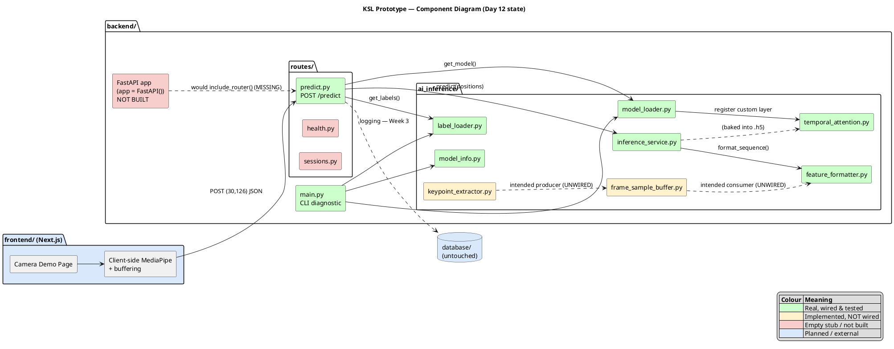
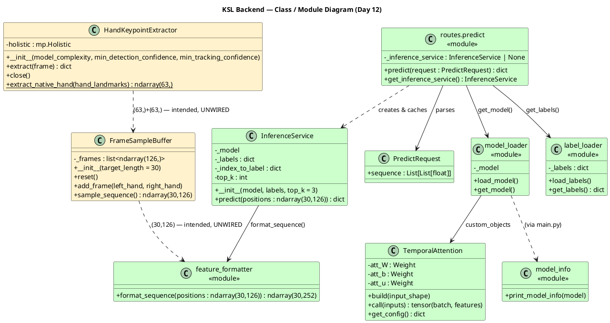
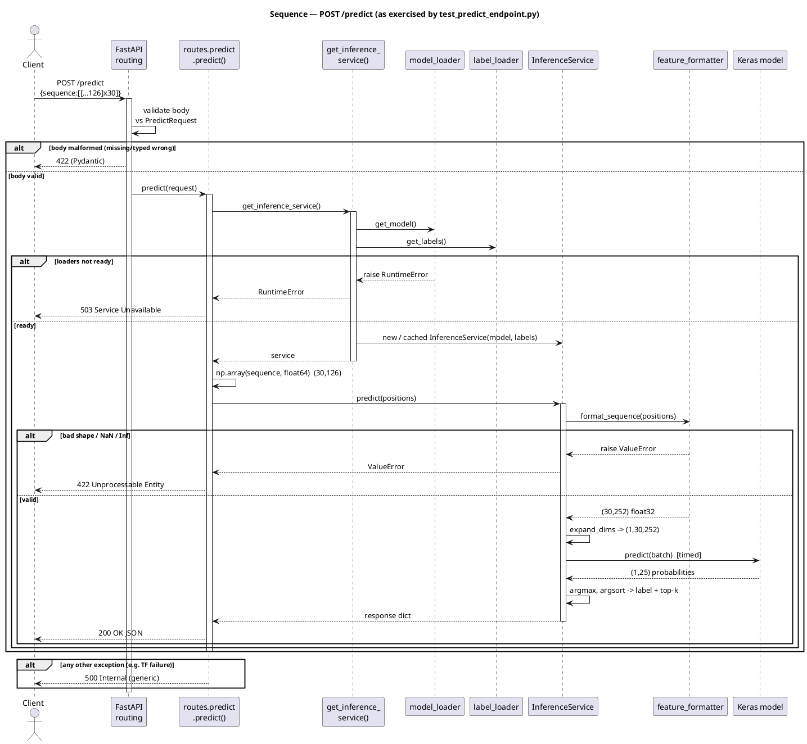
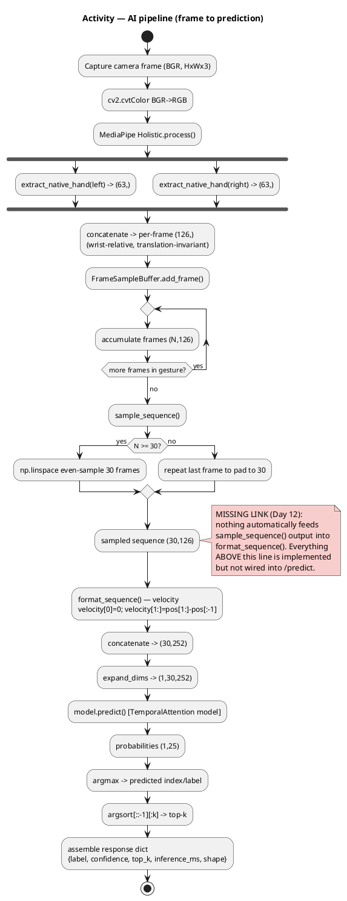
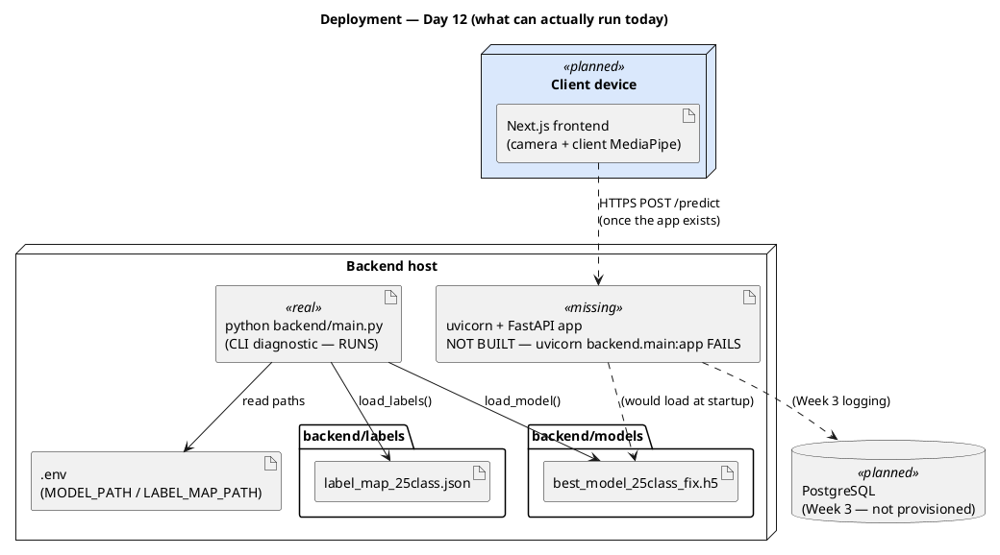
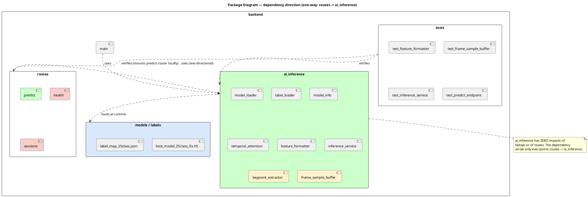
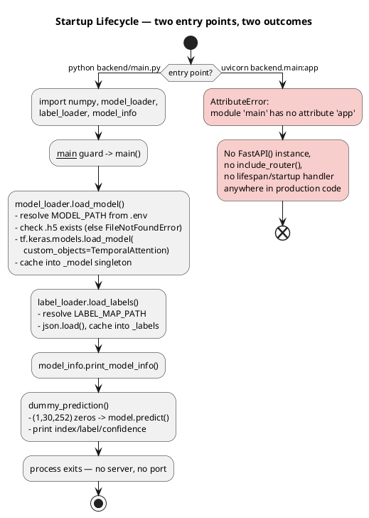
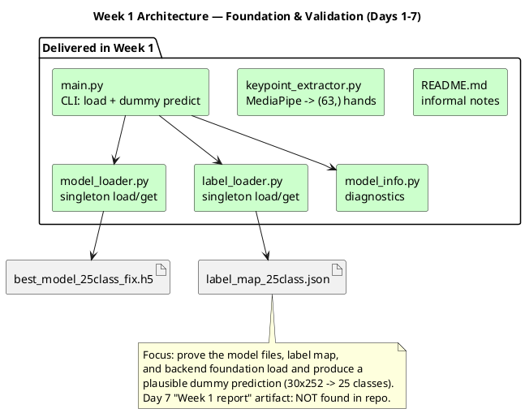
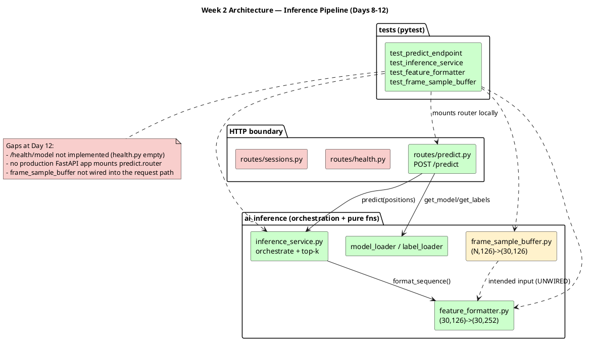
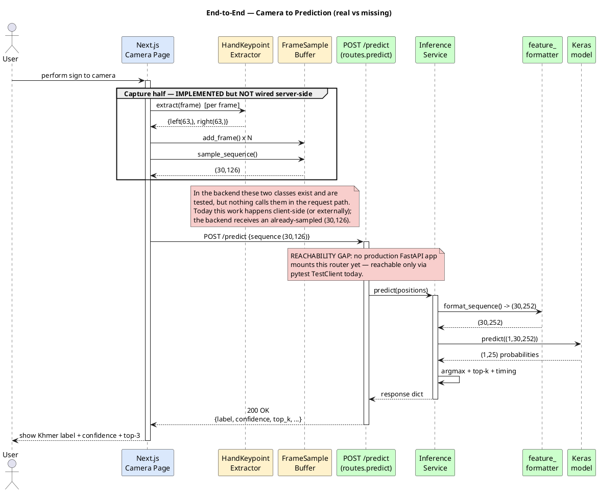

# Khmer Sign Language AI Prototype — UML Documentation

**Scope of truth:** these diagrams describe the backend **as it actually exists at Week 2 / Day 12**, cross-checked against `BACKEND_DOCUMENTATION.md`, `DAY12_AUDIT.md`, the repository source, and the 30-Day Plan. Where the 30-Day Plan assumes something that is not built yet (a live FastAPI app, `/health/model`, the camera→buffer wiring), the diagrams show it as *planned* or *missing* rather than pretending it exists. That honesty is deliberate — a UML that lies about what is wired would be worse than none.

Every diagram below is given as **PlantUML source** (paste into any PlantUML renderer, or the VS Code PlantUML extension) followed by a short explanation.

## Colour / status convention (used across all diagrams)

| Colour | Meaning |
|---|---|
| 🟢 `#CCFFCC` light green | Real — implemented, wired into the live path, and tested |
| 🟡 `#FFF2CC` light yellow | Implemented and unit-tested, but **not connected** into the HTTP request path |
| 🔴 `#F8CECC` light red | Empty stub (0 bytes) or not built at all |
| 🔵 `#DAE8FC` light blue | Planned / external component (frontend, database, future app) |

---

## 1. Component Diagram

**Explanation.** The backend splits cleanly into an HTTP boundary (`routes/`) and framework-agnostic ML logic (`ai_inference/`). Only `predict.py` is a real, tested router, and even it is mounted **only inside the test suite** — no production `FastAPI` app exists to include it, so the green boxes are reachable today only via pytest. `keypoint_extractor.py` and `frame_sample_buffer.py` (yellow) are complete and tested but nothing in the request path calls them; today the `(30,126)` sequence arrives pre-computed from the client. `health.py`/`sessions.py` are 0-byte stubs, and the database is not touched by any backend code yet.

---

## 2. Class Diagram

**Explanation.** The only true OOP classes are `HandKeypointExtractor`, `FrameSampleBuffer`, `TemporalAttention`, `InferenceService`, and the Pydantic `PredictRequest`; the rest of the backend is module-level functions with singleton globals, shown here with the `«module»` stereotype. The key design win is that `InferenceService` receives `model` and `labels` through its constructor (dependency injection) and never imports the loaders — which is exactly why it is testable with a mock model. `TemporalAttention` is a custom Keras layer that must be registered at load time or the `.h5` file cannot deserialize. The two dashed, yellow associations mark the shape-compatible-but-unconnected seam between the capture half and the inference half.

---

## 3. Sequence Diagram — `POST /predict`

**Explanation.** This is the real, tested request path. Pydantic rejects a malformed body with `422` before the handler runs. The handler stays thin: it fetches the singleton service, converts JSON to a numpy array, delegates, and maps exactly three exception classes onto `503` (dependencies not loaded), `422` (bad/NaN input from `feature_formatter`), and `500` (anything else, with internals hidden). All tensor math, timing, and label mapping happen inside `InferenceService`. Note the diagram starts from an already-sampled `(30,126)` body — MediaPipe and buffering are *not* part of this sequence today.

---

## 4. Activity Diagram — AI Pipeline

**Explanation.** The pipeline is two independently-correct halves. The upper half (frame → MediaPipe → wrist-relative `(63,)` hands → `(126,)` per frame → variable `(N,126)` → normalised `(30,126)`) is fully implemented and tested but disconnected. The `MISSING LINK` note marks exactly where the two halves fail to meet: today the `(30,126)` array arrives from the HTTP body, not from `FrameSampleBuffer`. The lower half (velocity augmentation → `(30,252)` → batch → model → argmax/top-k → response) is fully wired inside `InferenceService`.

---

## 5. Deployment Diagram

**Explanation.** The only thing deployable today is the `python backend/main.py` CLI diagnostic (green), which loads the model and label map, prints diagnostics, and runs one dummy prediction. The intended runtime — `uvicorn backend.main:app` — **fails today** because `main.py` never constructs a `FastAPI()` instance (red). The frontend and PostgreSQL are planned. The model `.h5`, label JSON, and `.env` are real on-disk artifacts consumed via path resolution.

---

## 6. Package Diagram

**Explanation.** The package layering is clean and one-directional: `routes → ai_inference`, never the reverse, and `ai_inference` contains no FastAPI imports at all. `main.py` and the test suite both depend on `ai_inference`; the tests additionally mount `routes.predict.router` into a throwaway app to verify it. `temporal_attention` sits inside `ai_inference` because it must be importable when `model_loader` deserialises the `.h5`.

---

## 7. Startup Lifecycle Diagram

**Explanation.** "Starting the backend" means two different things, and only one works. `python backend/main.py` runs a one-shot diagnostic that loads the model and labels into module-level singletons, prints info, runs a dummy forward pass, and exits. `uvicorn backend.main:app` fails immediately because there is no `app` object and no startup/lifespan handler anywhere in production code — this is the single most important fact before trying to serve predictions over HTTP.

---

## 8. Week 1 Architecture

**Explanation.** Week 1 established the foundation: singleton loaders for the model and label map (fail-fast on missing files), a diagnostics printer, the MediaPipe keypoint extractor, and a CLI `main.py` that ties loading together and runs a dummy `(1,30,252)` prediction to confirm the `.h5` and label JSON are compatible. Everything here loads and runs; the only tracked miss is that no Day-7 written report artifact exists in version control.

---

## 9. Week 2 Architecture

**Explanation.** Week 2 built the inference pipeline behind a thin HTTP boundary. `feature_formatter` (velocity augmentation), `frame_sample_buffer` (fixed-length sampling), and `inference_service` (orchestration + top-k) are all implemented and heavily unit-tested, and `routes/predict.py` exposes them through `POST /predict`. The remaining Day-12 gaps are concrete and specific: `/health/model` is unimplemented, no production app mounts the predict router, and the buffer is not spliced into the request path.

---

## 10. End-to-End Camera → Prediction Workflow

**Explanation.** This ties everything together and marks the two real gaps between the plan's vision and Day-12 reality. First, the capture half (`HandKeypointExtractor` → `FrameSampleBuffer`) exists and is tested in the backend but isn't invoked in the request path — today the `(30,126)` sequence is produced client-side/externally. Second, even the fully-wired inference half is reachable only through pytest, because no production `FastAPI` app mounts the router. Close those two gaps (assemble the app + wire the buffer chain, both reusing code that already exists) and this workflow becomes real end-to-end.

---

## Summary of what these diagrams encode

| Area | Real & wired | Implemented, unwired | Missing / stub |
|---|---|---|---|
| Model & label loading | ✅ `model_loader`, `label_loader` | — | — |
| Feature formatting | ✅ `feature_formatter` (30,126→30,252) | — | — |
| Inference orchestration | ✅ `InferenceService` + top-k | — | — |
| `/predict` route logic | ✅ tested (200/422/500/503) | — | not mounted in a live app |
| Keypoint extraction | — | 🟡 `HandKeypointExtractor` | — |
| Frame buffering | — | 🟡 `FrameSampleBuffer` | — |
| Camera→buffer splice | — | — | 🔴 no glue code |
| FastAPI app / startup | — | — | 🔴 no `app`, no lifespan |
| `/health/model` | — | — | 🔴 `health.py` empty |
| Session endpoints | — | — | 🔴 `sessions.py` empty |
| Database logging | — | — | 🔵 Week 3 |

The consistent story across all ten diagrams: the ML core is genuinely production-quality and well-tested in isolation; the two remaining pieces of work are **assembly** (wire the existing halves into one runnable app) and the **one missing health route** — neither of which requires new business logic.
